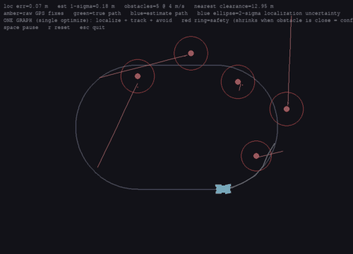

# gtsam-mpc

**Localization + multi-object tracking + control on a single factor graph**, with [GTSAM](https://gtsam.org/).

`JointLocTrackControl` fuses an entire autonomy stack into **one `NonlinearFactorGraph`, solved once per step**: the ego car localizes from noisy GPS, every moving obstacle is tracked and predicted, and a path-following MPC overtakes/avoids them — all jointly optimized.



*Amber = raw GPS · green = true path · blue = estimate (+2σ ellipse) · red = tracked obstacles · green line = MPC plan. The red safety ring shrinks as an obstacle is observed more strongly up close, and grows with track uncertainty.*

```python
import numpy as np
from gtsam_mpc import JointLocTrackControl

jtc = JointLocTrackControl(n_obstacles=3, safety_radius=3.0, n_sigma=1.5)
jtc.reset(x0, [obs0, obs1, obs2])          # each obstacle [px,py,vx,vy] or (px,py)

# one optimize() does estimation window + obstacle tracks + control horizon:
est, plan_states, plan_u, obs_est, obs_pred = jtc.step(u, gps, v_meas, dets, reference)
```

Two couplings make the single graph pay off:

- **uncertainty-aware avoidance** — each obstacle's keep-out radius is inflated by its track covariance (read from `gtsam.Marginals`), so the car gives uncertain tracks a wider berth;
- **range-aware sensing** — a closer obstacle is observed more strongly, tightening its track so the car can pass confidently.

Run it: `python examples/loc_track_control_sim.py` (space/r/esc). See **[ARCHITECTURE.md](ARCHITECTURE.md)** for the design.

## Why a factor graph

Estimation, control and tracking are all MAP inference on factor graphs built from one shared vocabulary of factors — so `JointLocTrackControl` is assembled from reusable pieces, each usable on its own:

| Component | Problem |
| --------- | ------- |
| `BicycleMPC` | nonlinear bicycle MPC; barrier / aug-Lagrangian / slack constraints |
| `MovingHorizonEstimator` | sliding-window localization |
| `JointEstimatorMPC` | localization + control, one graph |

```python
from gtsam_mpc import BicycleMPC, BicycleModel
mpc = BicycleMPC(BicycleModel(2.5, 0.1), Q=..., R=..., horizon=25, constraint_mode="al")
u = mpc.control(x0, goal)            # or mpc.simulate / a (horizon+1,4) reference + obstacles=
```

## Install

```bash
pip install -e ".[sim]"   # core + pygame; [dev] for pytest, [plot] for matplotlib
```

## Demos

Interactive (space pause, r reset, esc quit); all run headless with `SDL_VIDEODRIVER=dummy GTSAM_MPC_MAX_FRAMES=<n>`.

| Script | Shows |
| ------ | ----- |
| `loc_track_control_sim.py` | **full stack** (the headline above) |
| `loc_control_sim.py` / `joint_loc_control_sim.py` | localization + control (pipeline / single graph) |
| `path_following_sim.py` | bicycle MPC tracking selectable paths (1–5) |
| `bicycle_sim.py` | bicycle MPC to a clickable goal |
| `localization.py` | minimal odometry + GPS fusion sample |

Record the demo to a GIF: `python examples/make_gif.py out.gif --frames 300`.

## Test

```bash
pytest   # 28 tests
```

## License

MIT — see [LICENSE](LICENSE).
